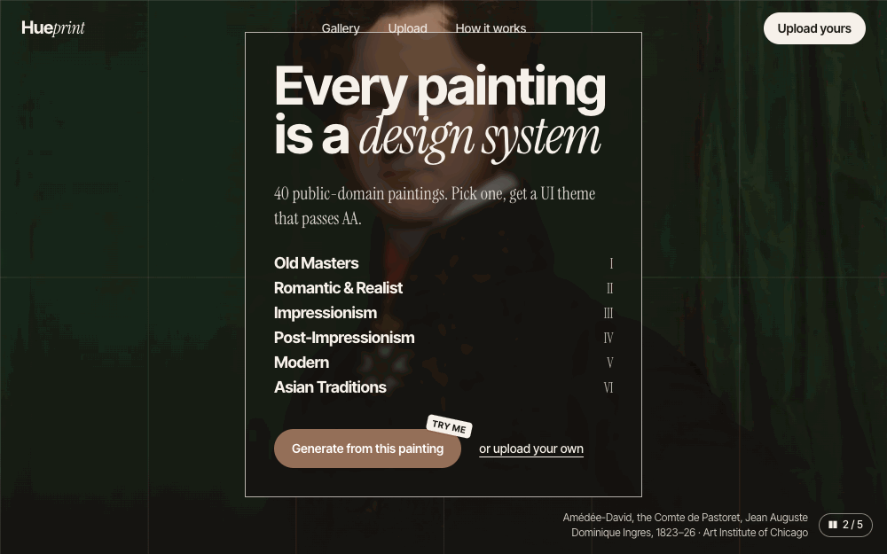
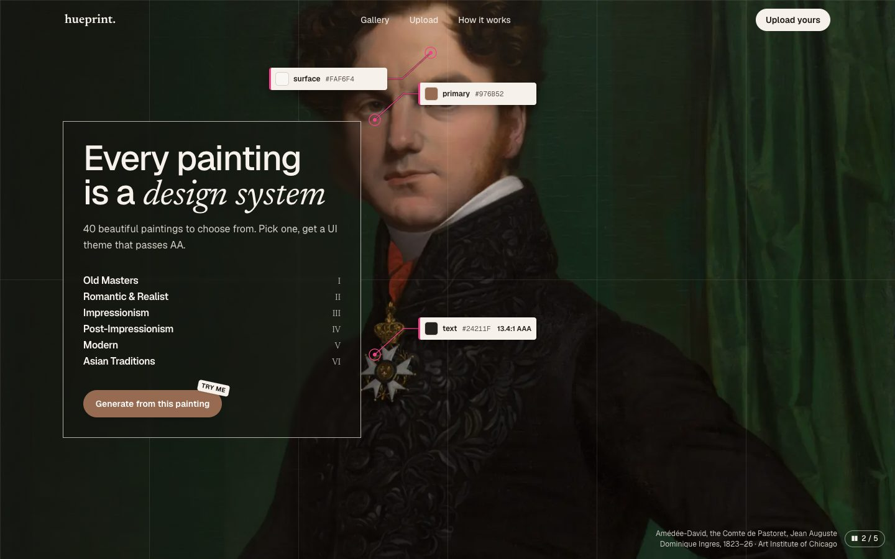
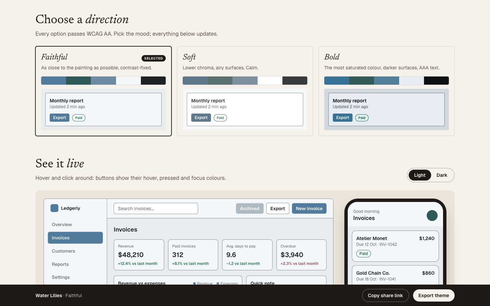
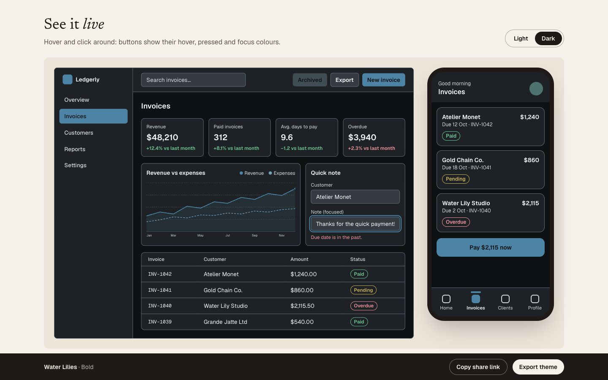
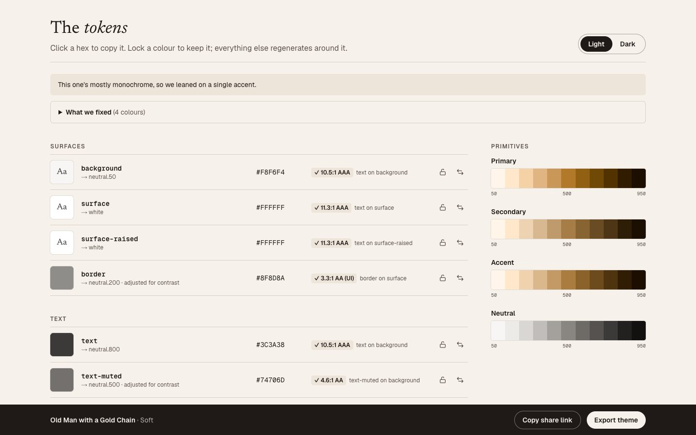
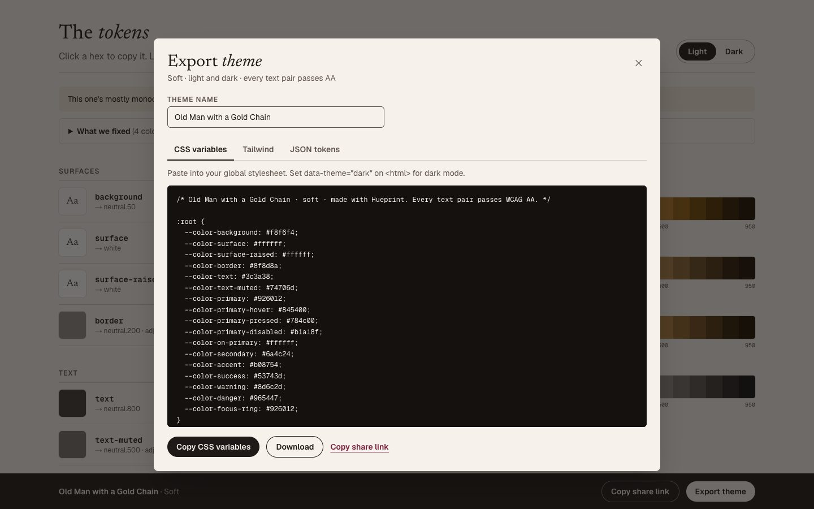
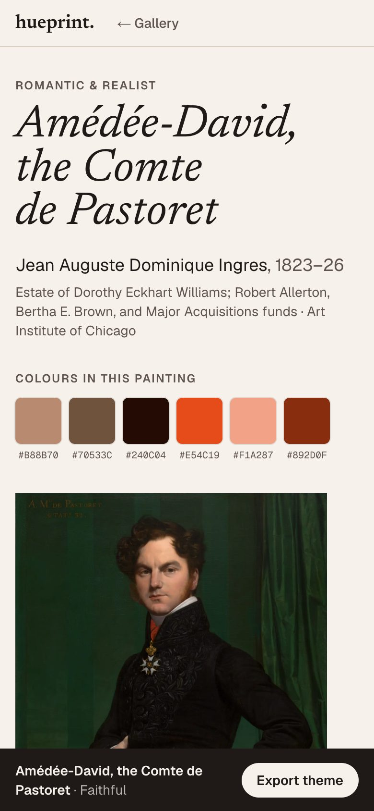

# Hueprint

**Any painting → a UI theme you can actually ship.**

Pick a public-domain painting (or drop in your own image) and Hueprint turns it into a full UI theme: colour roles, light and dark modes, a live dashboard preview, and exports for CSS, Tailwind and Figma. Every text pair passes WCAG AA.

**Try it: [hueprint-ten.vercel.app](https://hueprint-ten.vercel.app)** · no sign-up, export is free



---

## Why

Palette tools stop at swatches. They pull five colours from an image but don't tell you which one is the background, which is the text, or whether the button label is readable. Colours from paintings often fail contrast once they become UI, and dark mode is left as homework. Hueprint closes the gap between inspiration and a theme you can ship.

## What it does



- **A gallery of 40 paintings** from the Art Institute of Chicago, filterable by movement and mood. Hover a painting to see its colours before you commit.
- **"Redlines on a masterpiece".** The hero rotates through portraits, with Figma-style annotations pointing to the exact spot each theme colour comes from. An eyedropper loupe lets you sample any pixel.
- **Three directions per image:** Faithful (true to the painting), Soft (calm, low chroma) and Bold (most saturated colour, AAA text).
- **17 semantic tokens** (`background`, `surface`, `text`, `primary`, `on-primary`, hover and pressed states, status colours…) built on 50–950 colour scales, in light **and** dark.
- **Automatic contrast fixing**, with a plain-English "What we fixed" note: *"Darkened text-muted from #8a7f86 to #6e636a to pass AA (4.5:1) on background."*
- **Lock or swap any colour.** Everything else regenerates around it.
- **A live preview** on a sample dashboard and phone screen.
- **Export** to CSS variables, a Tailwind config, or W3C design tokens (JSON) for Figma via Tokens Studio.
- **Upload your own image** by drop, click or paste. It never leaves your device.
- **Shareable links.** The whole theme state lives in the URL (`?v=soft&mode=dark&lock=primary_c0392b`).

| Choose a direction | See it live (Bold, dark mode) |
| --- | --- |
|  |  |

| The tokens | Export |
| --- | --- |
|  |  |



## How the theme engine works

The engine lives in [`src/lib/theme/`](src/lib/theme) as pure TypeScript functions with no UI, so it is easy to test. All colour maths happens in **OKLCH**, where equal lightness steps look equal to the eye.

1. **Extract** 6 colours with `node-vibrant`, plus each colour's lightness, chroma, hue and coverage.
2. **Pick the brand colour:** the most saturated colour that covers a decent part of the image (chroma × √coverage).
3. **Build scales:** 50–950 for primary, secondary, accent and a neutral tinted with the painting's dominant hue. Faithful keeps the painting's exact colour as one of the steps.
4. **Assign roles** for each direction, in light and dark mode. Status colours start from fixed hues and lean up to 12° toward the painting.
5. **Fix contrast:** for every pair that must be readable, nudge lightness in small steps until it passes 4.5:1 (text) or 3:1 (UI). Hue and chroma stay, so it still looks like the same colour. Backgrounds are never moved to make room for a locked colour; a clear warning appears instead.
6. **Export** to CSS, Tailwind or DTCG JSON.

**The AA promise is tested:** the suite builds all 40 paintings × 3 directions × light and dark (240 themes) and checks every required pair. Writing those tests caught a real bug before release: in dark mode, the rule for picking button-label colours fought the rule for keeping buttons visible.

## Tech stack

| | |
| --- | --- |
| Framework | Next.js 16 (App Router) + TypeScript |
| Styling | Tailwind CSS v4 |
| Type | Newsreader (editorial), Geist (UI), Geist Mono (hex codes and code) |
| Colour | `node-vibrant` (extraction), `culori` (OKLCH + WCAG contrast) |
| Motion | Motion (Framer Motion) |
| Tests | Vitest |
| Data | Art Institute of Chicago API, fetched once by a script |
| Hosting | Vercel, deployed from GitHub |

Lighthouse (mobile, production build): Accessibility 100, Best Practices 100, SEO 100 on every page. Performance: theme pages 90–94, upload 92, home 87–88 (the hero headline waits for its two web fonts).

## Run it locally

You need Node.js 22.18 or newer (the paintings script runs TypeScript directly, which needs it).

```bash
npm install
npm run dev
```

Then open http://localhost:3000.

| Script | What it does |
| --- | --- |
| `npm run dev` | Start the dev server |
| `npm run build` / `npm start` | Production build / serve it |
| `npm test` | Run the Vitest suite |
| `npm run lint` | Lint |
| `npm run fetch:paintings` | Re-fetch the paintings from the AIC API into `data/paintings.json` and `public/paintings/` |

No environment variables are needed for the current version. `.env.example` lists any that later milestones add.

## Project structure

```
src/
  app/                  routes: home, /theme/[id], /theme/upload, 404, error
  components/
    home/               hero, redlines, loupe, gallery, upload, how it works
    theme/              option tiles, token panel, export panel, live preview
    upload/             drop zone and upload state
  lib/
    theme/              the theme engine (pure functions + tests)
    theme-url.ts        theme state ↔ URL
    paintings.ts        painting data helpers
scripts/fetch-paintings.ts
data/paintings.json
docs/BRIEF.md           scope, theme logic, roadmap
```

## Accessibility

- Every generated theme passes WCAG AA for text in light and dark mode (tested).
- Contrast badges spell out the ratio and level in text, never colour alone.
- Everything works by keyboard: the direction tiles are a radio group, the export panel is a native dialog, and the format tabs use arrow keys.
- With "reduce motion" on, the hero starts paused and the marquee, tilt and draw-in animations stop.
- The previews are announced as one described image, so screen reader and keyboard users skip the fake controls.

## Credits

Paintings courtesy of the [Art Institute of Chicago](https://www.artic.edu), public domain (CC0), via the [AIC API](https://api.artic.edu/docs/). The images are stored in this repo because AIC's image server only answers requests that identify themselves with an `AIC-User-Agent` header, which browsers can't send.

Designed and built by Nupur.

## Roadmap

- Sign in and save themes (Supabase, with Row Level Security)
- Unsplash search
- A public gallery of shared themes

See [`docs/BRIEF.md`](docs/BRIEF.md) for the full scope.
